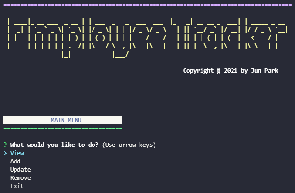

# Employee Tracker

[](https://opensource.org/licenses/IPL-1.0)

<p>
    
    
    
    
</p>

## Table of Contents
- [**Description**](#-description)
- [**Features**](#-features)
- [**Installation**](#-installation)
- [**Usage**](#-usage)
- [**License**](#-license)
- [**Demo Video**](#-demo-video)
- [**Questions**](#-questions)
- [**Contributing**](#-contributing)
- [**Author**](#-author)

## 📑 Description


As a business owner, don't you want to manage your employees, their roles, and their deparmtnets?  
It's time to use **Employee Tracker** to fulfill your needs!  

There are several things you need to complete before you run the app, so please look at this documentation carefully!

## ❗ Features
Followings are the features you can experience in the app.

1. **View** Options
    - View All Employees
    - View Employees by Manager
    - View Employees by Role
    - View Employees by Department
    - View All Roles
    - View All Departments
    - View the Total Utilized Budget of a Department
2. **Add** Options
    - Add Employee
    - Add Role
    - Add Department
3. **Update** Options
    - Update Employee Roles
    - Update Employee Manager
4. **Remove** Options
    - Remove Employee
    - Remove Role
    - Remove Department

## 💾 Installation
You would need to have the following **`npm`** packages for this app.
- **`mysql`**
- **`inquirer`**
- **`figlet`**
- **`validator`**
- **`dotenv`**
- **`console.table`**
- **`chalk`** 

You already have all the packages in your **`package.json`**?  
Then just type **`npm i`** in your terminal.

## 💻 Usage
Once you **`git clone`** this repository, make sure you create **`.env`** file in your cloned directory, and have following codes in your **`.env`**.
```
DB_HOST=localhost
DB_NAME=
DB_PASS=
DB_USER=
DB_PORT=3306
```
**Notes** 
- **`DB_NAME`**: the name of the database in **`./db/schema.sql`** 
- **`DB_USER`**: the root user of your **`MySQL`** Database.
- **`DB_PASS`**: the password of your **`MySQL`** Account.

Then **Copy & Paste** everything from **`schema.sql`** and **`seeds.sql`** in **`db`** folder to your **MySQL Workbench** and run the scripts to have all the tables and some seeded data.

Finished all the steps above?  
Type and run following command in your terminal.
- **`npm start`** 

## 🛠 License
This application is covered by the **ISC** license.

## 🎬 Demo Video
If you want to watch the demo video for how to use the application, check out the video below.  

**CLICK THE PLAY BUTTON**  
[](https://youtu.be/DtImnxCd0y0)


## ❔ Questions
🖐 If you have any question about me or my project, feel free to contact me!  
- **Github**: [**zzangu0215**](https://github.com/zzangu0215)  
- **Email**: **tajo0215@gmail.com**

## 🔥 Contributing
**Israel Magallon**
  - Portfolio: [**Portfolio**](https://imagallon.github.io/portfolio1.1/) (to be updated)
  - Email: **izzymagallonworks@gmail.com**
  - Github: [**GitHub**](https://github.com/imagallon)

## 😎 Author
- **Jun Park**
    - Portfolio: [**Portfolio**](https://zzangu0215.github.io/portfolio/) (to be updated)
    - Email: **tajo0215@gmail.com**
    - SNS: [**Instagram**](https://www.instagram.com/o0ojunny/)
